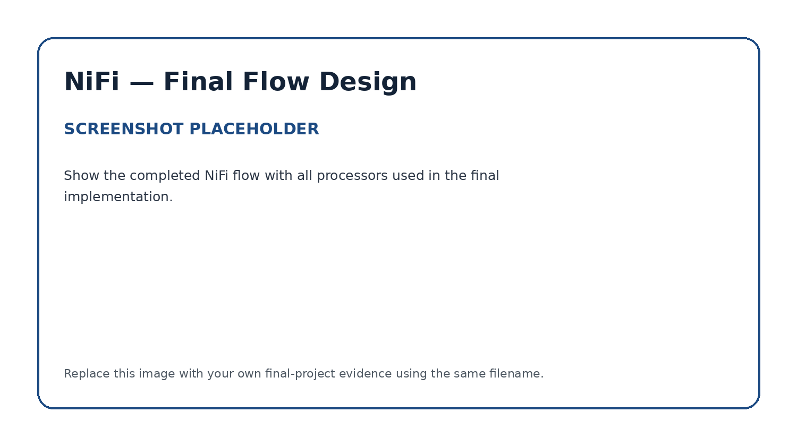
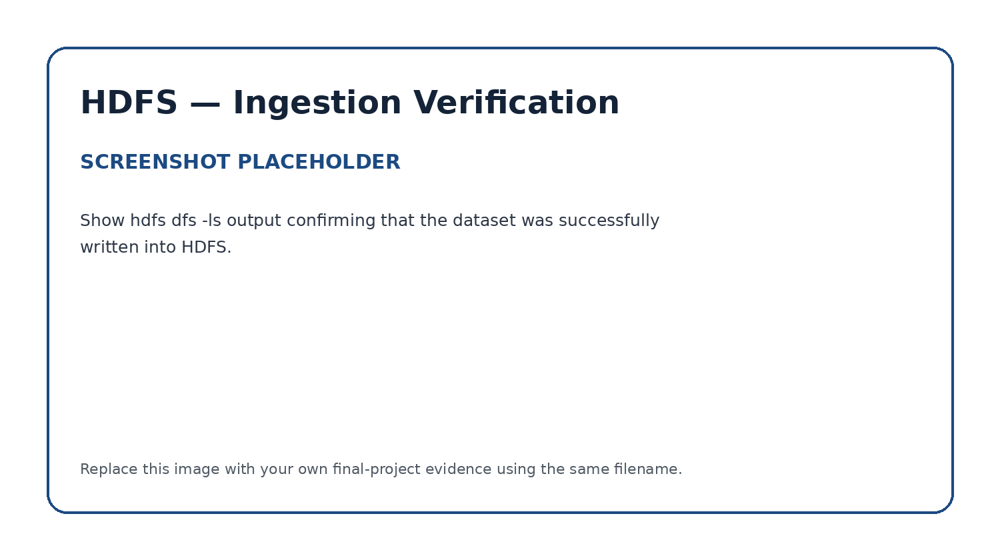

# Apache NiFi — Data Ingestion into HDFS

## Role in the Pipeline

Apache NiFi provides the ingestion and orchestration layer for this project. The completed flow retrieves the project dataset and writes it into HDFS for downstream processing.

## Source Dataset

**Dataset:** Energy Efficiency Dataset  
**GitHub direct URL:** (https://raw.githubusercontent.com/ferrillt/bigdata/refs/heads/main/energy_efficiency_data_100.csv)

I chose the Energy Efficiency Dataset which describes building characteristics and their associated heating and cooling requirements (Tsanas & Xifara, 2012a).  This dataset resulted from a study that looked into assessing the heating load and cooling load requirements of buildings – energy efficiency – as a function of building parameters (Tsanas & Xifara, 2012b).  This set contains eight input variables, including relative compactness, surface area, wall area, roof area, overall height, orientation, glazing area, and glazing area distribution.  Two additional variables – heating load and cooling load – represent the energy requirements associated with each building configuration.  The dataset does not contain any missing values which makes it well suited for demonstrating the complete data pipeline without requiring extensive data-cleaning activities.  
  
I chose to use the variable heating load as the prediction target while the building characteristics will serve as input features for the Spark MLlib model.  The dataset provides a useful basis for regression analysis as it allows the evaluation of the relationship between building design characteristics and heating requirements.  
The dataset contains 768 observations; however, due to the project environment’s limited computational resources and the project objective to demonstrate integration among the big-data technologies rather than large-scale processing, a random sample of 100 observations was selected for the final pipeline.  All original attributes were retained in the sampled dataset.  Using pandas and python, the following code was used to reduce the dataset:      
    
import pandas as pd    
\#Load the original Energy Efficiency dataset  
df = pd.read_csv("energy_efficiency_data.csv")  
  
print("Original Dataset Record Count: ", len(df))  
  
\# Select a reproducible random sample of 100 records  
sample_df = df.sample(n=100, random_state=650).reset_index(drop=True)  
  
\# Save the reduced dataset  
sample_df.to_csv("energy_efficiency_data_100.csv", index=False)  
  
\# Verify the reduced dataset  
print("Reduced Dataset Record Count: ", len(sample_df))  
print("\nSample of Reduced Dataset: ")  
print(sample_df.head())  
  
The python code was run using Jupyter Notebook:  

)

## Flow Design

Describe the important processors used in the final NiFi flow and the role each processor performs.

| Processor / Process Group | Role in the Flow |
|---|---|
| [Processor name] | [What it does] |
| [Processor name] | [What it does] |
| [Processor name] | [What it does] |

Explain how data moves from the source URL through NiFi and into HDFS.

## HDFS Destination

**HDFS path:** `[Enter final HDFS path]`

Explain where NiFi writes the dataset and how the destination is used by the next stage of the pipeline.

## Execution Evidence

### Final NiFi Flow

### Running Flow / Queue Activity

### HDFS Ingestion Verification

The HDFS screenshot should show the `hdfs dfs -ls` output confirming that the project dataset was successfully written into HDFS.
